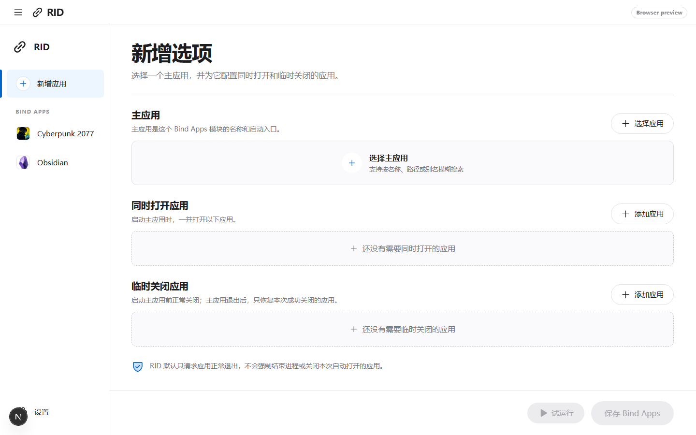

# RID

[English](README.md) | [简体中文](README.zh-CN.md)

一次打开需要的应用，临时收起不需要的应用。

RID 是一款 Windows 桌面工具。你可以围绕一个“主应用”创建联动规则：

- 打开主应用时，同时打开其他应用；
- 打开主应用前，临时关闭容易干扰的应用；
- 主应用退出后，只重新打开这一次由 RID 成功关闭的应用。

例如：

- 打开游戏，同时启动语音工具，并临时关闭截图软件；
- 打开 Obsidian，同时启动 Codex；
- 打开工作软件时，一并启动常用的编辑器和文件夹。



## 下载与安装

RID 当前支持 64 位 Windows 10 和 Windows 11。

1. 直接下载最新的 [RID Windows 安装程序](https://github.com/itoyohane/RID/releases/latest/download/RID_0.1.1_x64-setup.exe)，或打开 [GitHub Releases](https://github.com/itoyohane/RID/releases) 查看全部附件。
2. 普通用户请选择 `RID_0.1.1_x64-setup.exe`。
3. 双击安装程序，按照提示完成安装。
4. 安装完成后，从 Windows 开始菜单搜索并打开 **RID**。

如果你需要 MSI，可以下载 `RID_0.1.1_x64_en-US.msi`，它更适合企业部署或统一安装。

> RID 目前尚未签名。Windows SmartScreen 可能显示“Windows 已保护你的电脑”。请确认安装包来自本仓库的 Releases 页面，再点击“更多信息”→“仍要运行”。

卸载 RID：打开 Windows“设置”→“应用”→“已安装的应用”，找到 **RID** 并选择卸载。

### 静默安装

NSIS 安装程序支持当前用户范围的无人值守安装。`/S` 必须使用大写：

```powershell
Start-Process -Wait .\RID_0.1.1_x64-setup.exe -ArgumentList "/S"
```

使用 MSI 统一部署：

```powershell
msiexec.exe /i .\RID_0.1.1_x64_en-US.msi /quiet /norestart
```

自动发布流程会生成 SHA-256 校验文件和 GitHub 构建来源证明。验证方法和代码签名接入说明见
[Windows 发布安全说明](docs/windows-release.md)。

## 使用方法

1. 点击侧栏中的“新增应用”。
2. 选择主应用，再添加需要同时打开或临时关闭的应用。
3. 对无法正常退出的托盘应用，可在该应用的“更多操作”中选择“关闭失败时强制结束”。此选项可能导致未保存内容丢失，默认关闭。
4. 点击“试运行”确认操作，然后保存 Bind Apps。
5. 在保存成功窗口中点击“选择位置并创建”，选择桌面或其他文件夹。
6. 以后直接双击生成的“主应用名 · RID”快捷方式即可。

RID 会在后台执行关闭、打开、监控和恢复流程；主应用退出并完成恢复后，后台执行器会自动退出。

快捷方式保存的是 Bind Apps 的 ID，而不是一份独立配置。修改同一个模块时，RID 会直接覆盖原快捷方式。如果原快捷方式已被移动、重命名或删除，配置仍会正常保存，RID 会提示你重新选择位置。

RID 会自动搜索 Windows 中已安装的应用、桌面快捷方式和开始菜单快捷方式，并优先提取应用文件中的 Windows 原生图标。Steam 创建的 `.url` 游戏快捷方式也可直接搜索和绑定。

## 安全说明

- RID 默认请求应用正常退出，不会强制结束进程。
- 强制结束必须针对单个应用手动开启；它可能造成未保存内容丢失。
- 只恢复启动前正在运行、并且由 RID 成功关闭的应用。
- RID 会跟踪主应用启动器产生的后续进程，避免更新器或自重启造成过早恢复。
- 需要管理员权限的应用会由 Windows 显示 UAC；拒绝授权或启动失败时，RID 会恢复已关闭应用并显示原因。
- 执行记录保存在 `%APPDATA%\com.rid.desktop\logs\`。
- 浏览器预览只使用演示数据，不会控制电脑上的真实应用。
- 部分仅驻留系统托盘或以管理员身份运行的应用，可能无法被普通权限的 RID 关闭。

## 当前功能

- 创建、编辑和删除 Bind Apps；
- 搜索注册表、桌面及开始菜单中的本地应用；
- 读取 `.lnk` 快捷方式的目标、启动参数和工作目录；
- 搜索并启动 Steam 游戏快捷方式；
- 自动读取本地应用图标；
- 保存规则、试运行和正式运行；
- 在用户指定目录生成启动快捷方式；
- 从快捷方式后台执行 Bind Apps；
- 兼容 UAC，并提供按应用开启的强制结束兜底；
- 主应用退出后选择性恢复应用。
- 支持在英文和简体中文之间切换。首次启动时，RID 会读取 Windows 首选语言：
  中国大陆简体中文使用中文，其他地区和语言均默认使用英文。

## 开发

需要 Node.js、Rust 和 Windows WebView2 开发环境。

运行桌面应用：

```powershell
npm install
npm run tauri:dev
```

运行检查：

```powershell
npm run check
```

生成 Windows 安装包：

```powershell
npm run tauri:build
```

构建产物：

- `src-tauri/target/release/bundle/nsis/`：推荐给普通用户的 `.exe` 安装程序；
- `src-tauri/target/release/bundle/msi/`：MSI 安装包。

运行浏览器界面预览：

```powershell
npm run dev
```

浏览器预览无法检测或控制本地应用；需要原生能力时请运行 Tauri 桌面版。

技术实现见 [架构说明](docs/architecture.md)。
